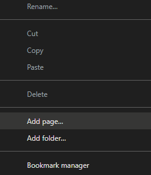
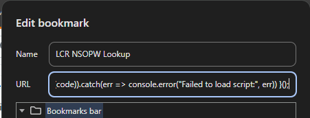

# LCR Utah Sex Offender Registry Search

Utah law will now require the Church to check both the Utah Child Abuse Offender Registry (“UCAOR”) (also called the Utah Sex and Kidnap Offender Registry) and the National Sex Offender Public Website (“NSOPW”) before allowing any individual age 18 or older to hold a calling that places them into the “regular and repeated care, supervision, guidance, or control” of anyone under age 18. The Church supported this legislation, which takes effect May 1, 2025. To meet the effective date, you should begin conducting the required searches and recording the certifications immediately.


This script will hopefully help speed that process up.


## Setup process
1. Install the [dynamic-load.js](dynamic-load.js) text as a bookmarklet
```
javascript: !function () { fetch("https://raw.githubusercontent.com/natewaldrop/utah-sex-offender-registry-search/refs/heads/main/test-search.js").then(res => res.text()).then(code => eval(code)).catch(err => console.error("Failed to load script:", err)) }();
```

* Add a new bookmark in your browser (Chrome shown)
* CTRL+SHIFT+B to show bookmarks bar if it isn't already visible
* Right-click on bookmark bar and select "Add Page"

* Edit the name and paste the javascript copied above as the URL
 
 * The bookmarklet is now installed


2. Log into LCR
3. Navigate to the [Member Directory](https://lcr.churchofjesuschrist.org/records/member-list?lang=eng) page
4. Scroll to the bottom of this page to make sure all members are loaded (the page dynamically loads 100 at a time)
5. Once all members are loaded, click the bookmark you just created


## What is this doing?

This script takes the names from your member directory and performs the search for each name against the NSOPW database.

It returns the list of results as though you had manually searched with first and last name on the [NSOPW website](https://www.nsopw.gov/search-public-sex-offender-registries)

* If no records are returned a new column will be added with **"Total Records: 0"**
* If there are records returned, it will load all records in and do a simple check on age and sex. If those don't match (+/- 1 year), it will strike the record through. 
* All records are linked to their various jurisdiction pages
* You can verify these names and alias' by reviewing the source jurisdiction page


> None of this data is being stored in LCR - it is modifying the local page from LCR within your browser. If you leave or refresh the page, it will reset all progress.


> To avoid losing any progress, hold CTRL while you click on each member to open their individual record in a new tab, where you can record "Utah 2024 Youth Service Organizations" in the Certification tab.

## FAQ
* ? Why is it so slow?
    * The NSOPW is pretty stingy with rate limiting - this tool attempts to slow things down so it can function 
* Did it stop?
    * If it gets enough 429 responses from the NSOPW database, it will cool down for 1 minute before continuing
